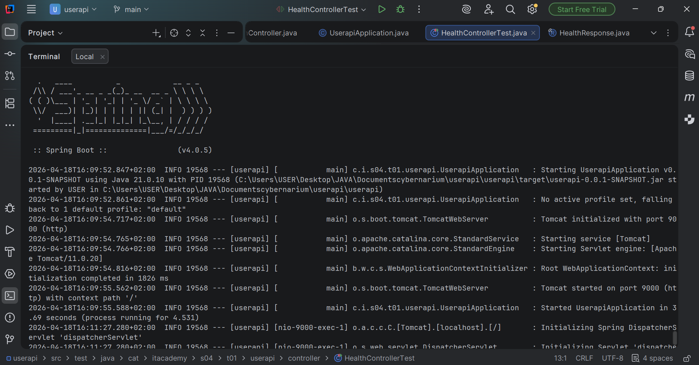
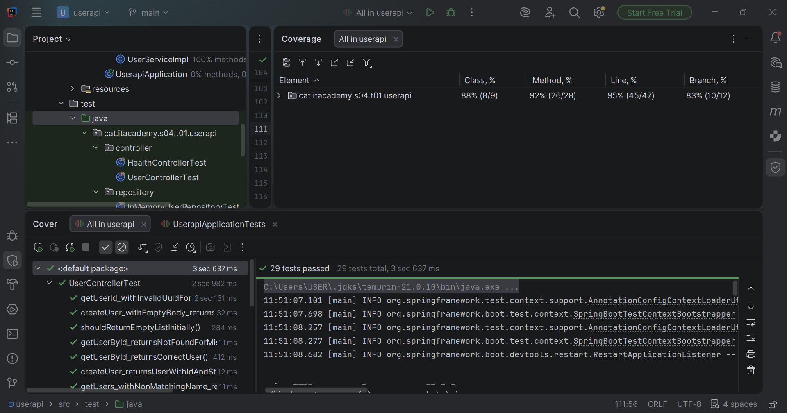
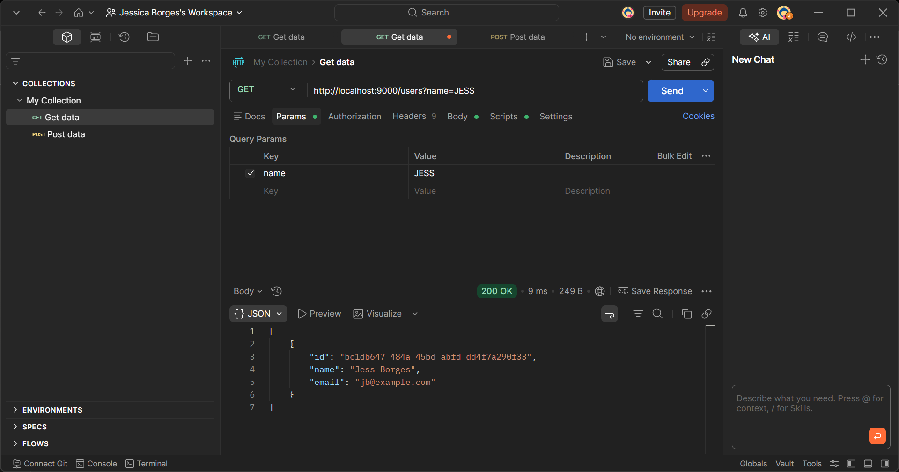

# 🚀 S04.01 - Spring Boot Introduction

My first REST API built with Spring Boot. This project manages users in memory and was built as part of IT Academy Barcelona's Java Backend bootcamp (Sprint 4). It covers all three levels of the exercise: basic health check, full CRUD endpoints, and a complete refactoring to layered architecture with TDD.

## 📋 What This Project Does

This is a User Management API that allows you to create users, list them, find them by ID, and filter them by name. It runs on port 9000 and stores everything in memory (no database yet — that comes in future sprints).

The API validates inputs, rejects duplicate emails, handles errors with proper HTTP status codes, and never exposes internal implementation details to the client. Every endpoint was tested manually with Postman and automatically with 29 tests covering happy paths, unhappy paths, and security edge cases.

## 🧠 What I Learned Building This

This was my first time working with Spring Boot, and these are the key concepts I applied:

- **Dependency Injection (IoC)**: Instead of creating dependencies with `new`, Spring manages and injects them through constructors. This makes the code testable and loosely coupled.
- **Layered Architecture**: Controller handles HTTP, Service handles business logic, Repository handles data. Each layer has one responsibility (SRP from SOLID).
- **REST API Design**: Proper use of HTTP methods (GET, POST), status codes (200, 201, 404, 409), path variables, query parameters, and JSON responses.
- **Testing at Three Levels**: Integration tests with MockMvc, unit tests for the repository, and Mockito-based unit tests for the service layer.
- **TDD (Test-Driven Development)**: The email duplicate validation was built test-first — I wrote the failing test, then implemented the code to make it pass.
- **Defensive Programming**: Input validation, null/blank checks, case-insensitive filtering, proper error responses for malformed requests and invalid UUIDs.

## 🛠️ Technologies

- Java 21 (Temurin)
- Spring Boot 4.0.5
- Maven (wrapper included — no local Maven installation needed)
- JUnit 5 + Mockito + MockMvc
- Postman (manual API testing)
- IntelliJ IDEA

## 📁 Project Structure

The project follows a layered architecture with clear separation of concerns:

```
src/main/java/cat/itacademy/s04/t01/userapi/
│
├── controller/                  # Receives HTTP requests, delegates to service
│   ├── HealthController.java    # GET /health — basic health check
│   └── UserController.java      # GET, POST /users — user CRUD operations
│
├── service/                     # Business logic — rules, validations, UUID generation
│   ├── UserService.java         # Interface defining use cases
│   └── UserServiceImpl.java     # Implementation with email validation
│
├── repository/                  # Data access — stores and retrieves users
│   ├── UserRepository.java      # Interface (contract) for data operations
│   └── InMemoryUserRepository.java  # In-memory implementation with ArrayList
│
├── model/                       # Data models
│   ├── User.java                # User entity with UUID, name, email
│   └── HealthResponse.java      # Health check response record
│
├── exception/                   # Custom exceptions with HTTP status mapping
│   ├── UserNotFoundException.java        # Returns 404 when user ID not found
│   └── EmailAlreadyExistsException.java  # Returns 409 when email is duplicate
│
└── UserapiApplication.java      # Spring Boot entry point
```

```
src/test/java/cat/itacademy/s04/t01/userapi/
│
├── controller/
│   ├── HealthControllerTest.java       # Health endpoint test
│   └── UserControllerTest.java         # Integration tests (10 tests)
│
├── repository/
│   └── InMemoryUserRepositoryTest.java # Repository unit tests (11 tests)
│
├── service/
│   └── UserServiceImplTests.java       # Mockito service tests (6 tests)
│
└── UserapiApplicationTests.java        # Context load test
```

## 🔌 API Endpoints

### Health Check

| Method | Endpoint | Description | Response |
|--------|----------|-------------|----------|
| GET | `/health` | Verifies the API is running | `{"status": "OK"}` — 200 |

### User Management

| Method | Endpoint | Description | Response |
|--------|----------|-------------|----------|
| GET | `/users` | Returns all users | `[...]` — 200 |
| GET | `/users?name=ada` | Filters users by name (partial, case-insensitive) | `[...]` — 200 |
| GET | `/users/{id}` | Returns a specific user by UUID | User JSON — 200 / 404 |
| POST | `/users` | Creates a new user (generates UUID, validates email) | User JSON — 201 / 409 |

### Error Responses

| Status Code | When | Example |
|-------------|------|---------|
| 400 Bad Request | Invalid UUID format, empty body, malformed JSON | `GET /users/not-a-uuid` |
| 404 Not Found | User ID does not exist | `GET /users/00000000-0000-0000-0000-000000000000` |
| 409 Conflict | Email already registered | `POST /users` with duplicate email |

## ⚙️ How to Install and Run

### Prerequisites

- Java 21 installed ([Adoptium Temurin](https://adoptium.net/))
- Git

### Clone and Run

```bash
git clone https://github.com/Borgesjesk/S04.01-Spring-Boot-Introduction.git
cd S04.01-Spring-Boot-Introduction
```

Start the application:
```bash
./mvnw spring-boot:run
```

The API will be available at `http://localhost:9000`

### Build and Run as JAR

```bash
./mvnw clean package
java -jar target/userapi-0.0.1-SNAPSHOT.jar
```



## 🧪 How to Test

### Run all automated tests

```bash
./mvnw test
```

### Run tests with coverage

In IntelliJ: right-click on the `test/` folder → **Run All Tests with Coverage**



### Manual testing with Postman

All endpoints were tested manually with Postman before writing automated tests. Example of the case-insensitive name filter working — searching "JESS" finds "Jess Borges":



## 📊 Test Coverage Results

| Metric | Coverage |
|--------|----------|
| Tests | 29 total, 0 failures |
| Classes | 88% (8/9) |
| Methods | 92% (26/28) |
| Lines | 95% (45/47) |
| Branches | 83% (10/12) |

### Tests by Layer

**🔗 Integration Tests (UserControllerTest — 10 tests):**
- Empty list initially, create user with UUID, get user by ID, 404 for missing ID, name filter, blank name filter, empty body returns 400, malformed JSON returns 400, invalid UUID returns 400, non-matching name returns empty list

**💾 Repository Unit Tests (InMemoryUserRepositoryTest — 11 tests):**
- Save adds to list, save returns user, empty list initially, find all returns saved users, find by ID when exists, find by ID when not exists, search by name matches, search case-insensitive, search no match returns empty, exists by email true, exists by email false

**🧩 Service Unit Tests with Mockito (UserServiceImplTests — 6 tests):**
- Create user generates UUID and saves, get all users when name is null, get all users filtered by name, get user by ID when exists, get user by ID throws exception when not exists, create user throws exception when email already exists (TDD)

**📦 Other:**
- Health controller test (1 test)
- Application context load test (1 test)

## 💻 API Usage Examples

### Create a user

```bash
curl -X POST http://localhost:9000/users \
  -H "Content-Type: application/json" \
  -d '{"name": "Ada Lovelace", "email": "ada@example.com"}'
```

Response (201 Created):
```json
{
    "id": "43b6fb80-fe05-44af-b450-85ff5c27ab11",
    "name": "Ada Lovelace",
    "email": "ada@example.com"
}
```

### Get all users

```bash
curl http://localhost:9000/users
```

### Filter by name (case-insensitive, partial match)

```bash
curl http://localhost:9000/users?name=ada
```

### Get user by UUID

```bash
curl http://localhost:9000/users/43b6fb80-fe05-44af-b450-85ff5c27ab11
```

### Try to create a user with duplicate email

```bash
curl -X POST http://localhost:9000/users \
  -H "Content-Type: application/json" \
  -d '{"name": "Another Ada", "email": "ada@example.com"}'
```

Response (409 Conflict): Email already exists.

## 🏗️ Architecture Decisions

- **Interface-based design**: Both `UserRepository` and `UserService` are interfaces. This follows the Dependency Inversion Principle — the controller depends on the service abstraction, the service depends on the repository abstraction. Swapping from in-memory storage to a real database only requires a new `UserRepository` implementation.
- **UUID for IDs**: Instead of sequential integers, UUIDs prevent IDOR (Insecure Direct Object Reference) attacks where an attacker could enumerate resources by guessing the next ID.
- **Defensive copies**: `findAll()` returns `List.copyOf()` to prevent external code from modifying the internal list.
- **Custom exceptions with @ResponseStatus**: `UserNotFoundException` maps to 404, `EmailAlreadyExistsException` maps to 409. Clean error responses without leaking stack traces.
- **Input validation**: Blank name parameters are treated as "no filter". Invalid UUIDs return 400. Missing request bodies return 400. The API never returns 500 for predictable bad input.
